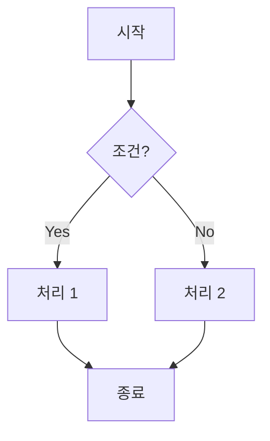
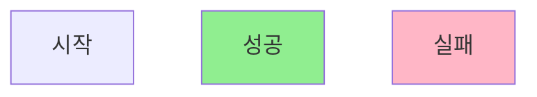

# 플로우 차트 (Flow Charts)

## 개요

이 디렉토리는 이커머스 시스템의 주요 비즈니스 로직과 의사결정 흐름을 플로우 차트로 시각화합니다.
플로우 차트는 조건 분기, 검증 로직, 상태 전환을 직관적으로 표현합니다.

모든 다이어그램은 Mermaid 형식으로 작성되며, GitHub에서 직접 렌더링되어 별도 도구 없이 확인할 수 있습니다.

## 목적

- **로직 흐름 파악**: 조건별 비즈니스 로직 분기 파악
- **검증 규칙**: 각종 입력값 검증 및 비즈니스 룰 명확화
- **상태 전환**: 엔티티 상태 변화의 가능한 경로 문서화
- **의사결정**: 시스템이 결정을 내리는 기준과 조건 시각화

## 다이어그램 작성 규칙

각 다이어그램은 다음 구조를 따릅니다:

```markdown
# [프로세스명]

## 개요
간단한 설명

## 입력/출력
- 입력 값
- 출력 결과

## 주요 검증 규칙
1. 규칙별 설명

## 플로우 차트
\```mermaid
flowchart TD
    Start[시작] --> Check{조건?}
    Check -->|Yes| Action1[액션]
    Check -->|No| Action2[다른 액션]
    Action1 --> End[종료]
    Action2 --> End
\```

## 에러 케이스
실패 케이스 설명

## 트랜잭션 범위
각 트랜잭션 범위
```

## 작성 예정 플로우 차트

이 디렉토리에 작성할 플로우 차트 목록:

1. **주문 상태 전환 흐름** - 주문 상태의 가능한 전환 경로
2. **결제 검증 흐름** - 결제 가능성/불가 조건 검증
3. **재고 검증 흐름** - 재고 가용성 체크 및 차감 검증
4. **쿠폰 검증 흐름** - 쿠폰 사용 가능 여부 및 조건 검증
5. **포인트 충전 검증 흐름** - 포인트 충전 금액 및 한도 검증

## Mermaid 문법 참고

### 기본 구조


### 노드 유형
- `[텍스트]`: 프로세스 (직사각형)
- `{텍스트}`: 의사결정 (마름모)
- `([텍스트])`: 터미널 (시작/종료)
- `[[텍스트]]`: 서브루틴
- `[(텍스트)]`: 데이터베이스 (원통형)

### 방향
- `TD`: Top to Down (위에서 아래)
- `LR`: Left to Right (왼쪽에서 오른쪽)
- `BT`: Bottom to Top
- `RL`: Right to Left

### 스타일링


## 참고 문서

- [Mermaid Flowchart 공식 문서](https://mermaid.js.org/syntax/flowchart.html)
- [요구사항 문서](../requirements/)
- [ERD 문서](../ERD/)
