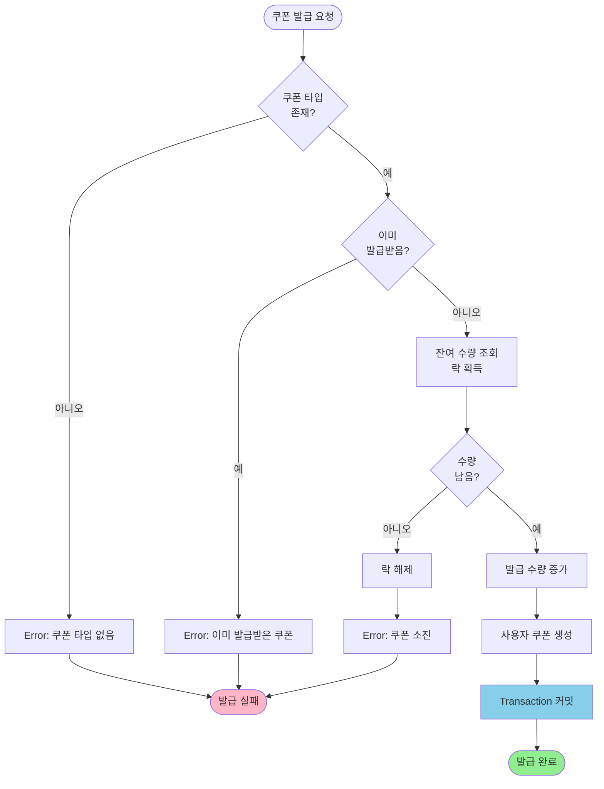

# 쿠폰 발급 플로우

## 개요

선착순 제한 수량 쿠폰을 사용자에게 발급하는 과정의 검증 및 처리 흐름입니다.

## 플로우 차트

```mermaid
flowchart TD
    Start([쿠폰 발급 요청]) --> ValidateType{쿠폰 타입<br/>존재?}

    ValidateType -->|아니오| ErrorNotFound[Error: 쿠폰 타입 없음]
    ValidateType -->|예| CheckDuplicate{이미<br/>발급받음?}

    CheckDuplicate -->|예| ErrorDuplicate[Error: 이미 발급받은 쿠폰]
    CheckDuplicate -->|아니오| LockQuantity[잔여 수량 조회<br/>락 획득]

    LockQuantity --> CheckQuantity{수량<br/>남음?}

    CheckQuantity -->|아니오| ReleaseLock1[락 해제]
    ReleaseLock1 --> ErrorSoldOut[Error: 쿠폰 소진]

    CheckQuantity -->|예| IncreaseIssued[발급 수량 증가]
    IncreaseIssued --> CreateUserCoupon[사용자 쿠폰 생성]
    CreateUserCoupon --> Commit[Transaction 커밋]
    Commit --> End([발급 완료])

    ErrorNotFound --> EndError([발급 실패])
    ErrorDuplicate --> EndError
    ErrorSoldOut --> EndError

    style End fill:#90EE90
    style EndError fill:#FFB6C6
    style Commit fill:#87CEEB
```
