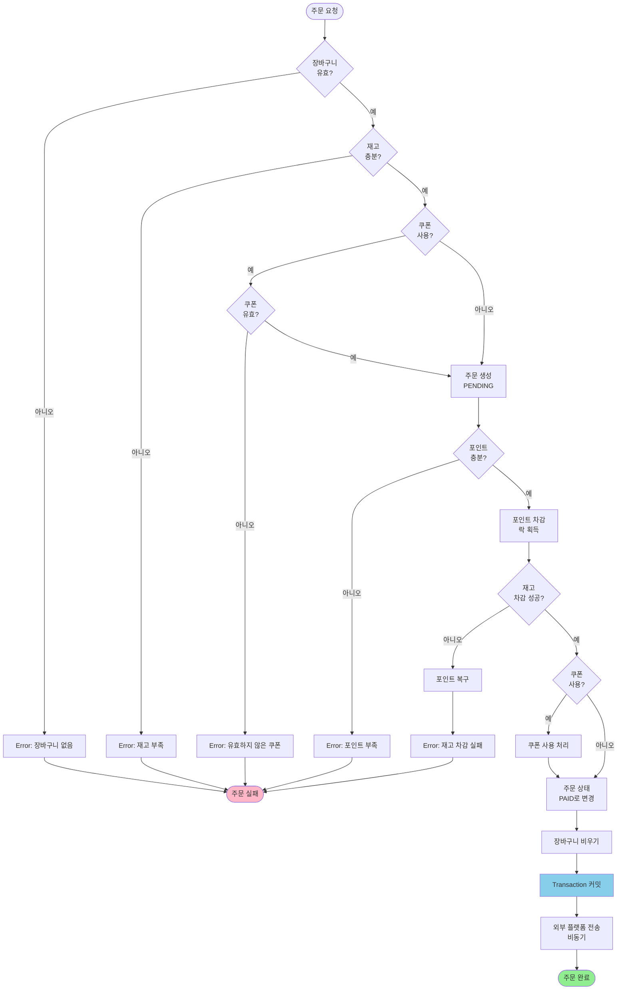

# 사용자 주문 및 결제 플로우

## 개요

사용자가 장바구니 상품을 주문하고 포인트로 결제하는 과정의 검증 및 처리 흐름입니다.

## 플로우 차트

```mermaid
flowchart TD
    Start([주문 요청]) --> ValidateCart{장바구니<br/>유효?}

    ValidateCart -->|아니오| ErrorCart[Error: 장바구니 없음]
    ValidateCart -->|예| CheckStock{재고<br/>충분?}

    CheckStock -->|아니오| ErrorStock[Error: 재고 부족]
    CheckStock -->|예| HasCoupon{쿠폰<br/>사용?}

    HasCoupon -->|예| ValidateCoupon{쿠폰<br/>유효?}
    HasCoupon -->|아니오| CreateOrder[주문 생성<br/>PENDING]

    ValidateCoupon -->|아니오| ErrorCoupon[Error: 유효하지 않은 쿠폰]
    ValidateCoupon -->|예| CreateOrder

    CreateOrder --> DeductPoint{포인트<br/>충분?}

    DeductPoint -->|아니오| ErrorPoint[Error: 포인트 부족]
    DeductPoint -->|예| LockPoint[포인트 차감<br/>락 획득]

    LockPoint --> DeductStock{재고<br/>차감 성공?}

    DeductStock -->|아니오| RollbackPoint[포인트 복구]
    RollbackPoint --> ErrorStockFinal[Error: 재고 차감 실패]

    DeductStock -->|예| UseCoupon{쿠폰<br/>사용?}

    UseCoupon -->|예| MarkCouponUsed[쿠폰 사용 처리]
    UseCoupon -->|아니오| UpdateOrderStatus[주문 상태<br/>PAID로 변경]

    MarkCouponUsed --> UpdateOrderStatus
    UpdateOrderStatus --> ClearCart[장바구니 비우기]
    ClearCart --> Commit[Transaction 커밋]
    Commit --> SendExternal[외부 플랫폼 전송<br/>비동기]
    SendExternal --> End([주문 완료])

    ErrorCart --> EndError([주문 실패])
    ErrorStock --> EndError
    ErrorCoupon --> EndError
    ErrorPoint --> EndError
    ErrorStockFinal --> EndError

    style End fill:#90EE90
    style EndError fill:#FFB6C6
    style Commit fill:#87CEEB
```
