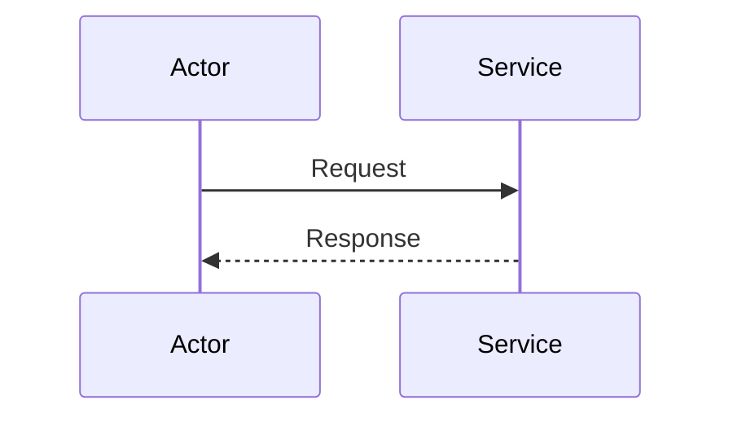

# 시퀀스 다이어그램 (Sequence Diagrams)

## 개요

이 디렉토리는 이커머스 시스템의 주요 비즈니스 프로세스를 시퀀스 다이어그램으로 시각화합니다.
시퀀스 다이어그램은 시스템 컴포넌트 간의 상호작용과 시간 순서를 명확하게 보여줍니다.

모든 다이어그램은 Mermaid 형식으로 작성되며, GitHub에서 직접 렌더링되어 별도 도구 없이 확인할 수 있습니다.

## 목적

- **비즈니스 흐름 이해**: 복잡한 프로세스의 전체 흐름 파악
- **컴포넌트 상호작용**: 각 API 호출과 서비스 간 통신 흐름 문서화
- **동시성 제어**: 트랜잭션 처리 및 동시성 제어 전략 명확화
- **에러 핸들링**: 실패 시나리오와 롤백 흐름 문서화

## 다이어그램 작성 규칙

각 다이어그램은 다음 구조를 따릅니다:

```markdown
# [프로세스명]

## 개요
간단한 설명

## 참여자 (Participants)
- Actor/Service 목록

## 주요 흐름
1. 단계별 설명

## 시퀀스 다이어그램
\```mermaid
sequenceDiagram
    ...
\```

## 에러 처리
실패 시나리오 설명

## 트랜잭션 범위
각 트랜잭션 범위
```

## 작성 예정 다이어그램

이 디렉토리에 작성할 시퀀스 다이어그램 목록:

1. **주문 생성 및 결제 프로세스** - 전체 주문/결제 흐름
2. **포인트 충전 프로세스** - 사용자 포인트 충전 및 검증
3. **쿠폰 발급 프로세스** - 쿠폰 발급 및 선착순 처리
4. **재고 차감 프로세스** - 재고 차감 및 동시성 제어
5. **외부 연동 흐름** - 데이터 플랫폼 전송 및 재시도

## Mermaid 문법 참고

### 기본 구조


### 화살표 종류별 의미
- `->`: 비동기 메시지 (실선 화살표)
- `-->`: 비동기 응답 (점선)
- `->>`: 동기 메시지 (실선 화살표)
- `-->>`: 동기 응답 (실선 점선)

### 제어 구조
- `Note over A,B: 설명`: 노트 추가
- `alt/else/end`: 조건 분기
- `opt/end`: 선택적 실행
- `loop/end`: 반복
- `par/and/end`: 병렬 실행

## 참고 문서

- [Mermaid Sequence Diagram 공식 문서](https://mermaid.js.org/syntax/sequenceDiagram.html)
- [요구사항 문서](../requirements/)
- [ERD 문서](../ERD/)
