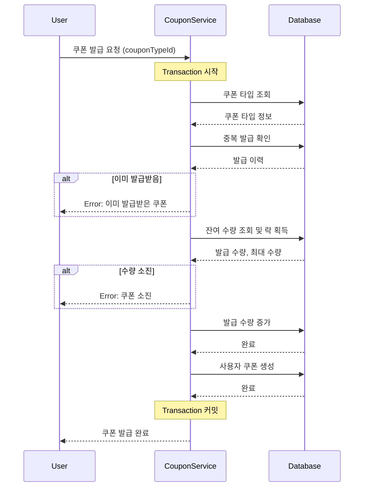

# 쿠폰 발급 프로세스

## 개요

선착순 제한 수량 쿠폰을 사용자에게 발급하는 프로세스입니다. 동시 발급 요청 시 수량 제어와 중복 발급 방지를 포함합니다.

## 시퀀스 다이어그램

```mermaid
sequenceDiagram
    participant User
    participant CouponService
    participant Database

    User->>CouponService: 쿠폰 발급 요청 (couponTypeId)

    Note over CouponService: Transaction 시작

    CouponService->>Database: 쿠폰 타입 조회
    Database-->>CouponService: 쿠폰 타입 정보

    CouponService->>Database: 중복 발급 확인
    Database-->>CouponService: 발급 이력

    alt 이미 발급받음
        CouponService-->>User: Error: 이미 발급받은 쿠폰
    end

    CouponService->>Database: 잔여 수량 조회 및 락 획득
    Database-->>CouponService: 발급 수량, 최대 수량

    alt 수량 소진
        CouponService-->>User: Error: 쿠폰 소진
    end

    CouponService->>Database: 발급 수량 증가
    Database-->>CouponService: 완료

    CouponService->>Database: 사용자 쿠폰 생성
    Database-->>CouponService: 완료

    Note over CouponService: Transaction 커밋

    CouponService-->>User: 쿠폰 발급 완료
```
