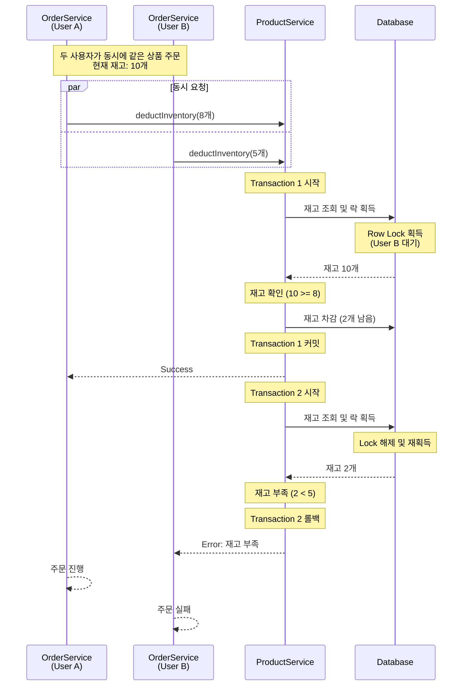

# 재고 차감 동시성 제어

## 개요

여러 사용자가 동시에 같은 상품을 주문할 때, 재고 초과 차감을 방지하고 데이터 일관성을 보장하는 프로세스입니다.

## 시퀀스 다이어그램

```mermaid
sequenceDiagram
    participant OS1 as OrderService<br/>(User A)
    participant OS2 as OrderService<br/>(User B)
    participant PS as ProductService
    participant DB as Database

    Note over OS1,OS2: 두 사용자가 동시에 같은 상품 주문<br/>현재 재고: 10개

    par 동시 요청
        OS1->>PS: deductInventory(8개)
        and
        OS2->>PS: deductInventory(5개)
    end

    Note over PS: Transaction 1 시작
    PS->>DB: 재고 조회 및 락 획득
    Note over DB: Row Lock 획득<br/>(User B 대기)
    DB-->>PS: 재고 10개
    Note over PS: 재고 확인 (10 >= 8)
    PS->>DB: 재고 차감 (2개 남음)
    Note over PS: Transaction 1 커밋
    PS-->>OS1: Success

    Note over PS: Transaction 2 시작
    PS->>DB: 재고 조회 및 락 획득
    Note over DB: Lock 해제 및 재획득
    DB-->>PS: 재고 2개
    Note over PS: 재고 부족 (2 < 5)
    Note over PS: Transaction 2 롤백
    PS-->>OS2: Error: 재고 부족

    OS1-->>OS1: 주문 진행
    OS2-->>OS2: 주문 실패
```
