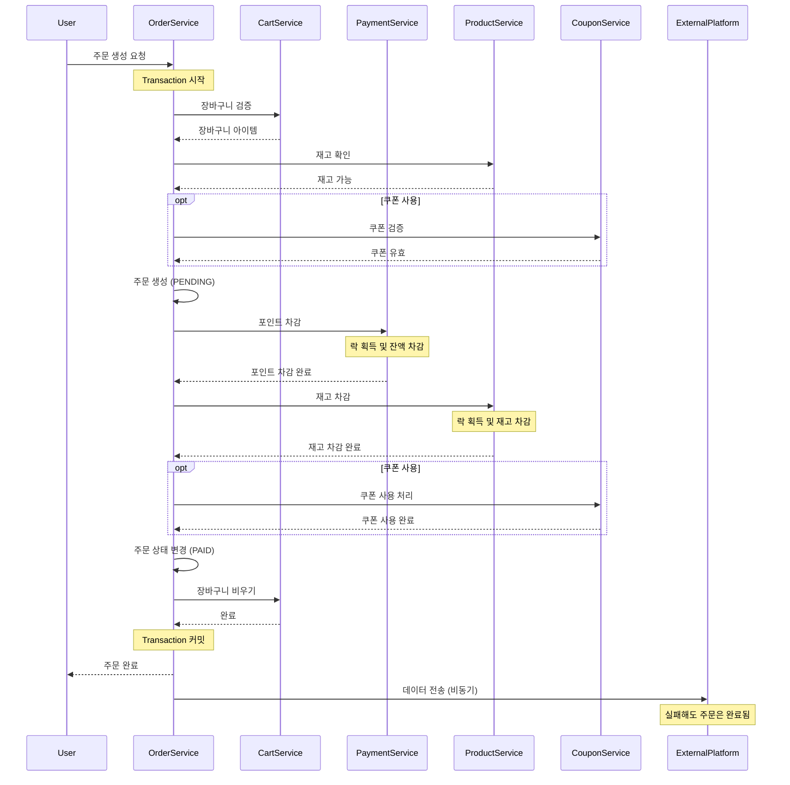

# 주문 생성 및 결제 프로세스

## 개요

사용자가 장바구니 상품을 주문하고 포인트로 결제하는 핵심 비즈니스 프로세스입니다.

## 시퀀스 다이어그램

```mermaid
sequenceDiagram
    participant User
    participant OrderService
    participant CartService
    participant PaymentService
    participant ProductService
    participant CouponService
    participant ExternalPlatform

    User->>OrderService: 주문 생성 요청

    Note over OrderService: Transaction 시작

    OrderService->>CartService: 장바구니 검증
    CartService-->>OrderService: 장바구니 아이템

    OrderService->>ProductService: 재고 확인
    ProductService-->>OrderService: 재고 가능

    opt 쿠폰 사용
        OrderService->>CouponService: 쿠폰 검증
        CouponService-->>OrderService: 쿠폰 유효
    end

    OrderService->>OrderService: 주문 생성 (PENDING)

    OrderService->>PaymentService: 포인트 차감
    Note over PaymentService: 락 획득 및 잔액 차감
    PaymentService-->>OrderService: 포인트 차감 완료

    OrderService->>ProductService: 재고 차감
    Note over ProductService: 락 획득 및 재고 차감
    ProductService-->>OrderService: 재고 차감 완료

    opt 쿠폰 사용
        OrderService->>CouponService: 쿠폰 사용 처리
        CouponService-->>OrderService: 쿠폰 사용 완료
    end

    OrderService->>OrderService: 주문 상태 변경 (PAID)

    OrderService->>CartService: 장바구니 비우기
    CartService-->>OrderService: 완료

    Note over OrderService: Transaction 커밋

    OrderService-->>User: 주문 완료

    OrderService->>ExternalPlatform: 데이터 전송 (비동기)
    Note over ExternalPlatform: 실패해도 주문은 완료됨
```
