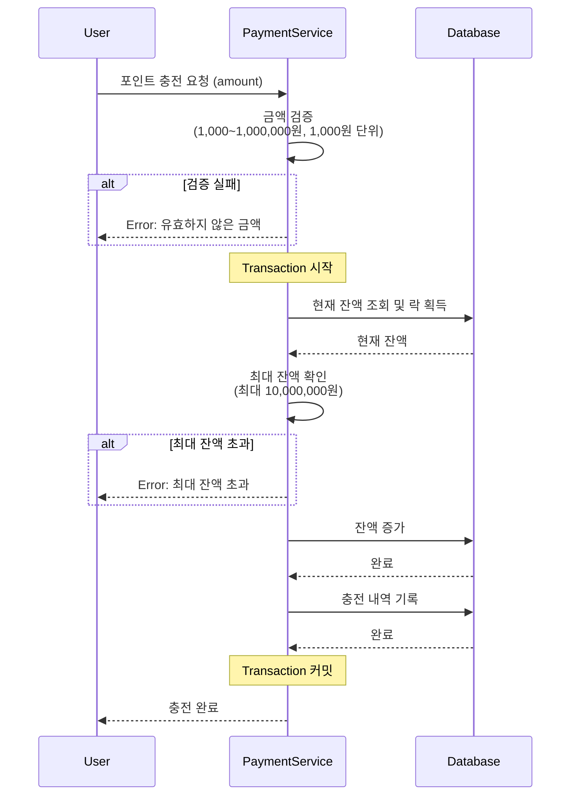

# 포인트 충전 프로세스

## 개요

사용자가 결제에 사용할 포인트를 충전하는 프로세스입니다. 충전 금액 검증, 최대 잔액 확인, 원자적 충전 처리를 포함합니다.

## 시퀀스 다이어그램

```mermaid
sequenceDiagram
    participant User
    participant PaymentService
    participant Database

    User->>PaymentService: 포인트 충전 요청 (amount)

    PaymentService->>PaymentService: 금액 검증<br/>(1,000~1,000,000원, 1,000원 단위)

    alt 검증 실패
        PaymentService-->>User: Error: 유효하지 않은 금액
    end

    Note over PaymentService: Transaction 시작

    PaymentService->>Database: 현재 잔액 조회 및 락 획득
    Database-->>PaymentService: 현재 잔액

    PaymentService->>PaymentService: 최대 잔액 확인<br/>(최대 10,000,000원)

    alt 최대 잔액 초과
        PaymentService-->>User: Error: 최대 잔액 초과
    end

    PaymentService->>Database: 잔액 증가
    Database-->>PaymentService: 완료

    PaymentService->>Database: 충전 내역 기록
    Database-->>PaymentService: 완료

    Note over PaymentService: Transaction 커밋

    PaymentService-->>User: 충전 완료
```
